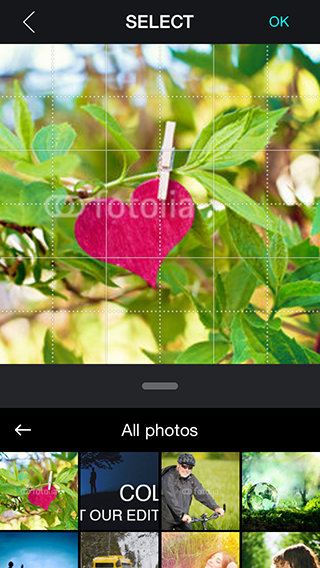

InstagramPhotoPicker
====================


###TWInstagramPhotoPicker:###
Present Image Picker like Instagram

* lets you add custom actions to extend the picker
* allows you to select different photo albums

## Installation

With [CocoaPods](http://cocoapods.org/), add this line to your Podfile.

    pod 'TWPhotoPicker', '~> 1.0.1' or
    pod 'TWPhotoPicker', :git => 'https://github.com/vladzz/InstagramPhotoPicker.git'

## Screenshots





## Usage

```objective-c
    TWPhotoPickerController *photoPicker = [[TWPhotoPickerController alloc] init];
    photoPicker.cropBlock = ^(UIImage *image, NSURL *originalAssetURL) {
        //do something
    };
    [self presentViewController:photoPicker animated:YES completion:NULL];
```

## Requirements

- iOS 7 or higher
- Automatic Reference Counting (ARC)

## Author

- [wenzhaot](https://github.com/wenzhaot) ([@Wenzhaot](https://twitter.com/Wenzhaot))
- [vladzz](https://github.com/vladzz) ([@vladzz](https://twitter.com/vladzz))
- [mikeantonelli](https://github.com/mikeantonelli)

## License

TWPhotoPicker is released under the MIT license. See the LICENSE file for more info.
